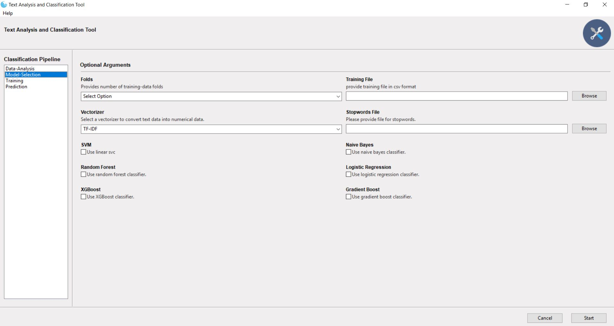
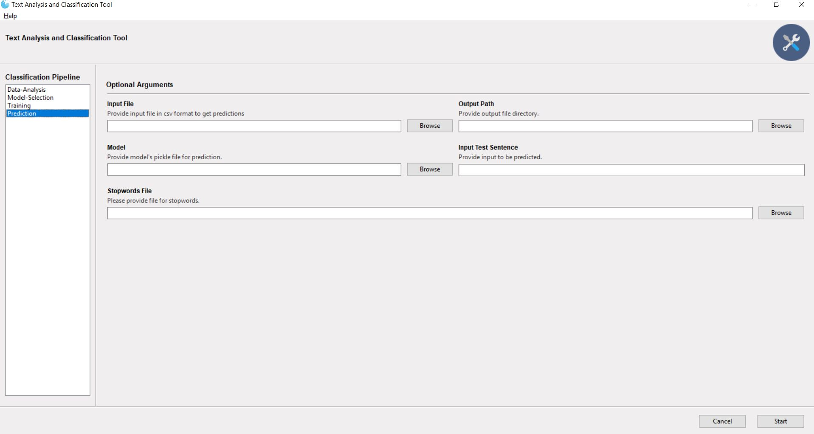

# Text Analysis and Classification GUI

## What's the tool about?
 -  A Data analysis and Text Classification Tool is a python GUI application which has following pipelines built in it.
    - Data Analysis
    - Model Selection
    - Training
    - Prediction
 - This tool is helpful in retraining the models on new/modified data and revised/modified classes and compares the performance of new models with previous models
  

## Create a python environment or a conda environment to run the application.
 -  Simple Python Environment
    - Install Python 3.6.x version 
    - open command prompt and run following command to install required python dependencies
    ``` 
        pip install -r requirements.txt
    ``` 
 - Anaconda Environment
    - If you have anaconda installed on your machine, follow the steps to create conda environment
    ```
        conda create --name text_classification_env pip python=3.6.4 anaconda
        conda activate aci_env
        pip install -r requirements.txt
    ```
     
## How to use the tool.
 - Run main_gui_program.py file. A graphical user interface will pop up.
 - Data Analysis Pipeline
    - This pipeline will analyse the input file provides. It will consider following points of analysis
            
        - How many records are there in input data file?
        - How many classes and what is the data distribution of the sentences for each class?
        - What are the most important keywords in the file and how the keywords can be weighted according to their importance.
    - Also it will have visual interpretation of the textual data present in the input file
        - e.g. 1. word cloud with different colours
        
         
 - A model selection pipeline which allows you to select multiple text classification models, comapare their accuracies 
   based on the K-Fold Cross-Validation. It supports famous text classification models (linear as well as non-linear)
   
        - SVM and Linear SVM
        - Logistic Regression
        - Naive Bayes
        - Random Forests
        - XG Boosting Algorithm
        - Gradient Boosting Algorithm
    
  

 - A training pipeline which allows you to train the model selected from model selection pipeline or any. 
        - Classification Report
        - Confusion Matrix in graphics form
        - Training Accuracy and Validation Accuracy
  
  
  
 - A prediction pipeline which allows you to provide input file and generate output prediction file 
 
 
  

## Format of the input files to be provided
 - Input Dataset files should be provided with .CSV(comma separated values) format
 - It should have following columns of data
    - class
    - sentence
    - ID
## What is next?
 - We will focus on the following pipelines to be added in the existing workflow
    - data cleaning pipeline with flexibility
    - parameter tuning pipeline(Grid Search Algorithm?)
    - Dimensionality Reduction Techniques for text  
## License and  copyright
 -  